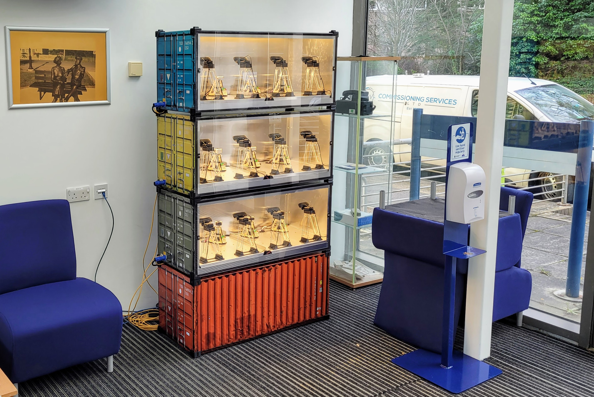

# Jump

![alt text][logo]

![alt text][status]

Jump is an external jump server for admin (ssh) access to remote machines that are not served with a conventional private-network-side jump machine. Jump provides a secure external relay for `ssh` sessions, that works together with clients on the host (remote) and client (local) machines.

Relay is a set of tools and services to let you to host remote lab experiments, without opening firewall ports.

 - Secure login shell relay, host adapter and client for end-to-end encrypted admin access without a jumpserver 
 - Works with experiments behind firewalls and NAT because all communications are relayed 
 - No need to open firewall ports, or get public IPv4 addresses.
 
## Background
 
Institutional networks vary in their ability to provide admin access to machines, so this jump server alternative allows a more convenient administrative option.
  
## Status

We've got over 50 experiments under management at the present time - with some of our latest in our new 1:6 scale ISO containers:

## Limitations

Human-operated `ssh` sessions work well but `ansible` connections tend to fail (perhaps due to the number of connections required and/or a potential issue with handling large file transfers). At present, administration over `jump`  must be done manually. Further work is intended but currently on hold pending availability of development capacity/prioritisation. If you would like to sponsor this work, please get in touch.

## Overview

This repo provides the `jump` command for relaying `ssh` connections, with the following sub-commands 

0. `jump host` runs on the experiment to connect to the `shell relay` to provide secured `ssh` connections to the experiment
0. `jump relay` runs in the cloud (to connect experiments and administrators)
0. `jump client` runs on the administrators' systems to connect to the `shell relay` 

### More information

Additonal documentation (in various states of completeness) can be found on the following components here:

0. [jump relay](./internal/shellrelay/README.md)
0. [jump host](./internal/shellhost/README.md)

## References

[1] Timothy D. Drysdale (corresponding author), Simon Kelley, Anne-Marie Scott, Victoria Dishon, Andrew Weightman, Richard James Lewis & Stephen Watts (2020) Opinion piece: non-traditional practical work for traditional campuses, Higher Education Pedagogies, 5:1, 210-222, DOI: 10.1080/23752696.2020.1816845 

[2] David P. Reid, Joshua Burridge, David B. Lowe, and Timothy D. Drysdale (corresponding author), Open-source remote laboratory experiments for controls engineering education, International Journal of Mechanical Engineering Education, Accepted 22 Jan 2022. 

[status]: https://img.shields.io/badge/status-operating-green "status; alpha"
[logo]: ./img/logo.png "Relay ecosystem logo - hexagons connected in a network to a letter R"

